# 如何在指纹浏览器中设置IPDEEP代理IP？

IPDEEP提供全球高匿名代理IP服务，涵盖动态、静态、移动、数据中心IP等，做跨境业务的基本上都会使用到代理IP服务，下面小编以[比特指纹浏览器](https://www.bitbrowser.cn/)为例，为大家详细介绍如何在指纹浏览器中设置IPDEEP代理IP。

## 一、注册购买IPDEEP代理IP类型

IPDEEP代理IP提供动态、移动、静态、数据中心IP，支持多城市、多运营商节点，可根据业务需求购买合适的IP类型。

具体操作步骤：

1.进入[IPDEEP官网](https://www.ipdeep.cn/)，注册登录后台。

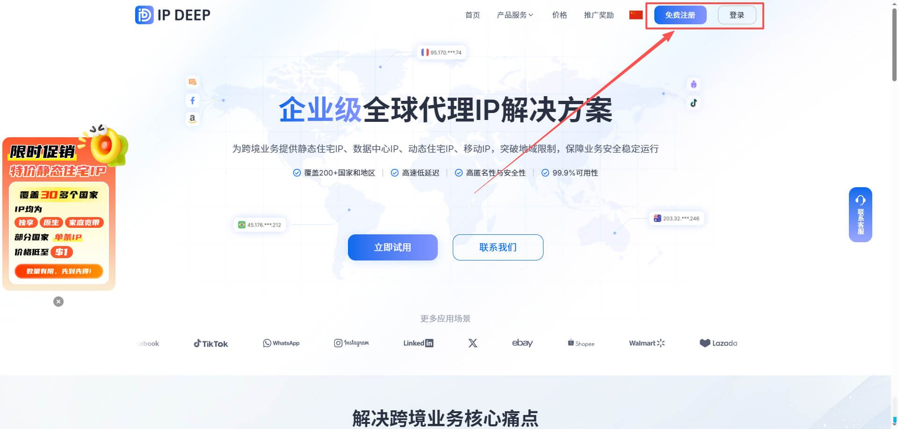

2.根据需求选择合适的代理IP（以静态住宅代理为例）

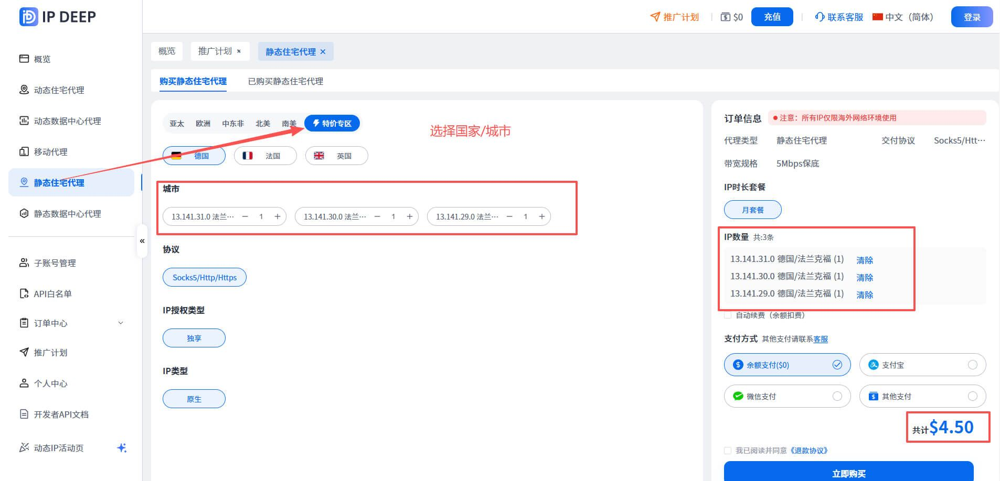

3.购买完成点击【已购买静态住宅代理】

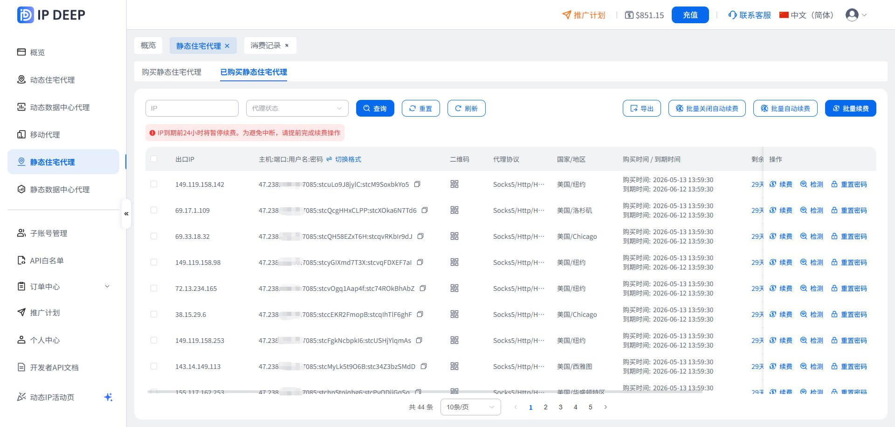

## 二、本地切换外网访问

代理IP不支持国内使用，所以本地环境需要切换到外网去使用。可以使用市面上的第三方服务工具，比如快连、小火箭等。

以快连工具为例：

1.下载注册快连账号，开通套餐

2.点击变更国家和地区，选择切换网络，即可切换到外网。

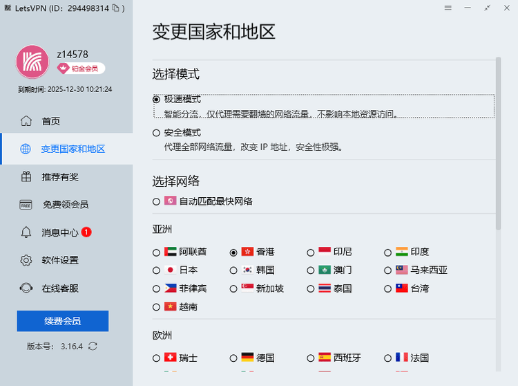

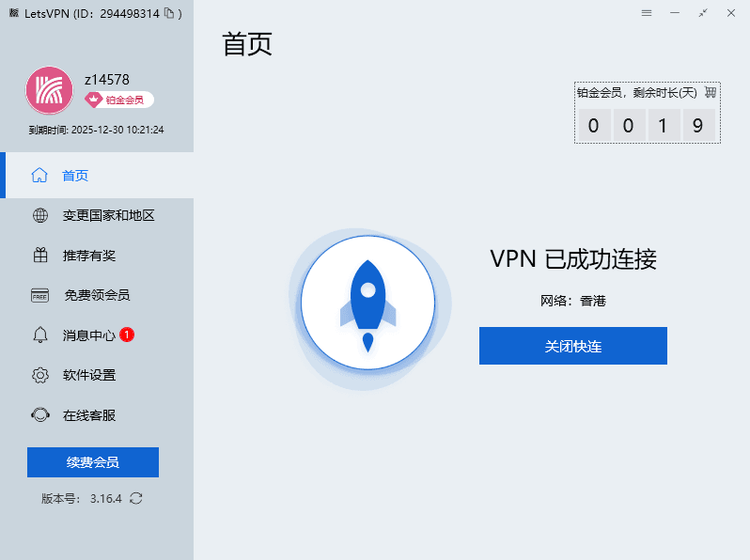

## 三、下载指纹浏览器（以比特指纹浏览器为例）

1.进入[比特浏览器官网](https://www.bitbrowser.cn/)

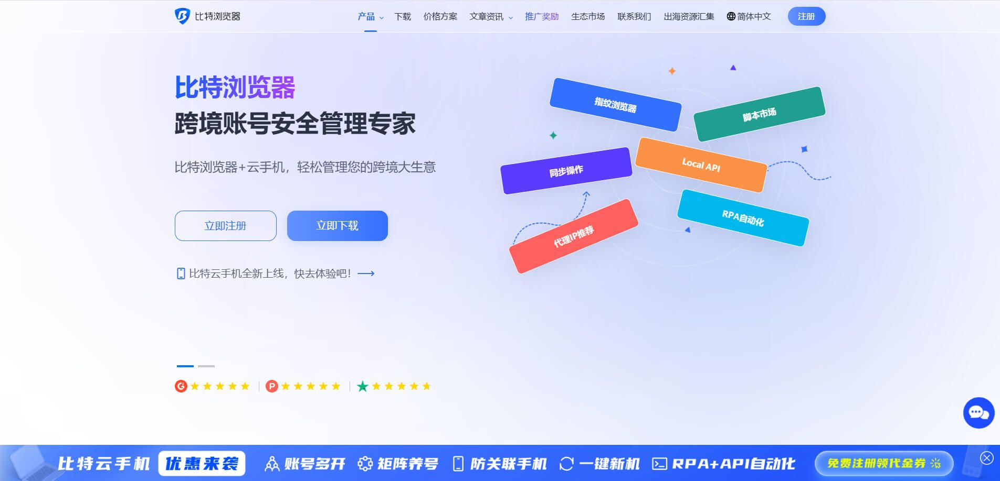

2.[下载](https://www.bitbrowser.cn/download)适配电脑的操作版本

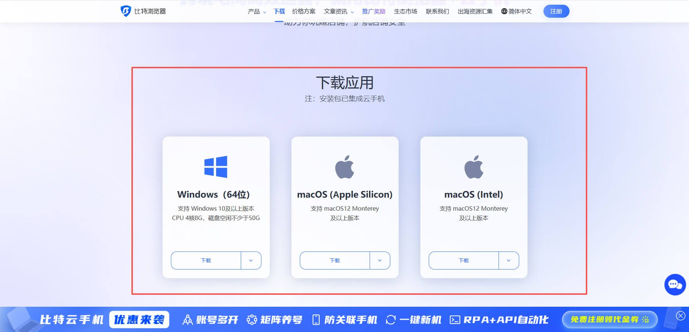

3.注册登录比特浏览器，点击浏览器窗口，创建窗口【比特浏览器支持免费试用10个窗口环境】

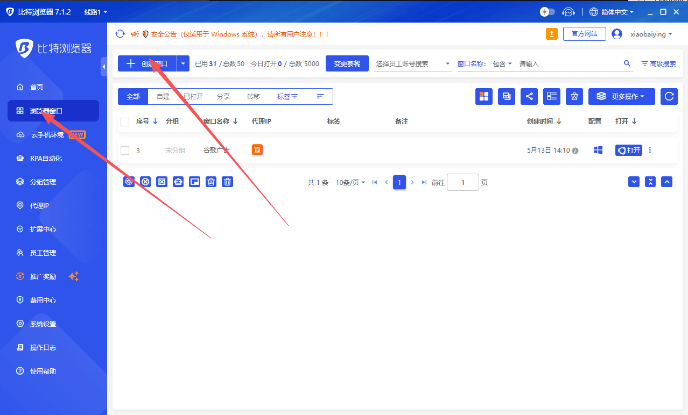

4.滑到 代理设置 > 自定义代理 > 代理类型 > 输入你在IPDEEP平台购买的静态住宅IP

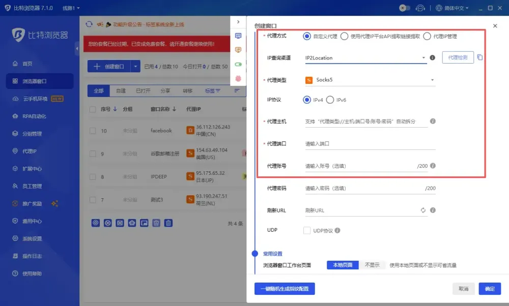

5. 代理主机对应服务器 > 代理端口对应端口号 > 代理账号对应 账号 > 代理密码对应 密码，复制即可。

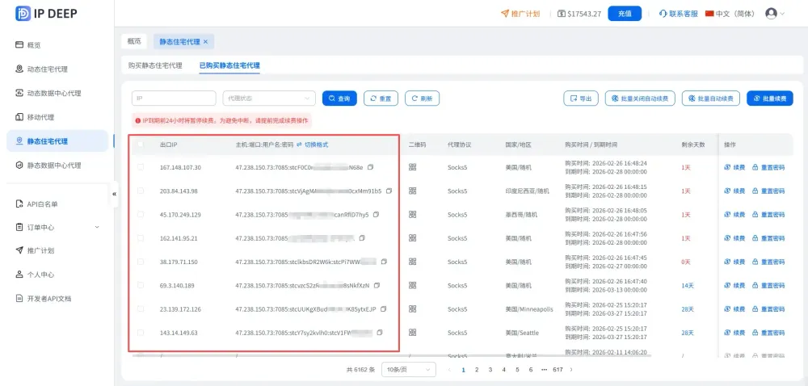

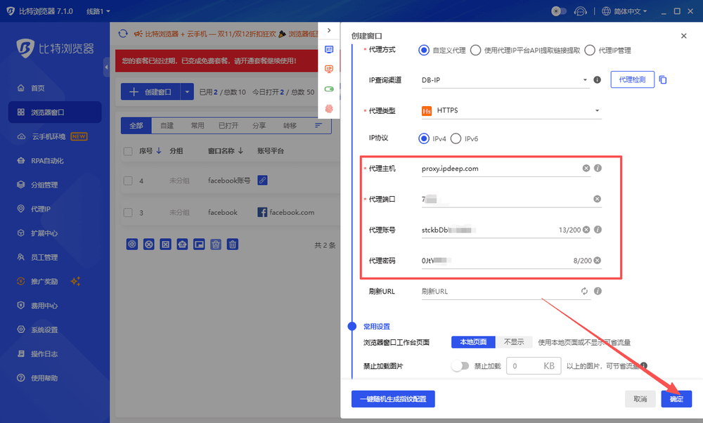

6.输入完成，点击确定，IPDEEP静态住宅IP即绑定成功，点击打开按钮即可使用指纹浏览器。

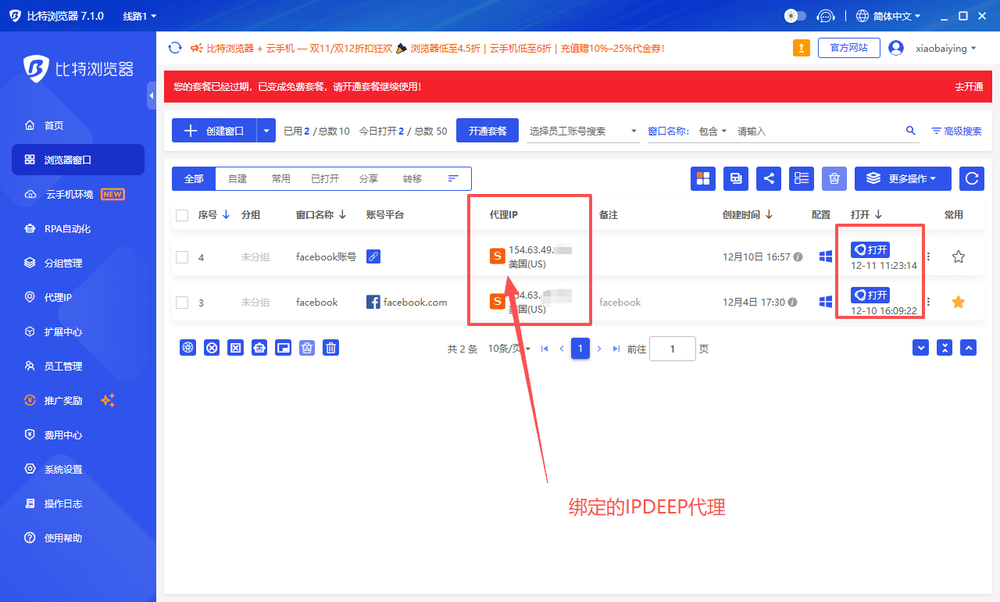
